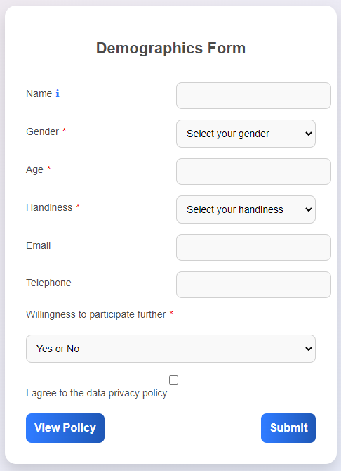
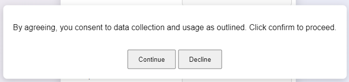
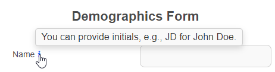

# My Academic and Professional Profiles

### Creating a Functional and Tested Demographics Form for JATOS Studies

When conducting online studies, collecting accurate demographic information is critical for analyzing participant data. This code provides a fully functional and tested solution for integrating a demographics form with the JATOS framework, ensuring smooth data storage and user redirection. 

#### **Functionality Overview**

The code captures participant details, including name, gender, age, handiness, and willingness to participate in future studies. Upon form submission, it saves the data directly to the JATOS server and redirects participants to the next stage of the study, specified as `next.html`. If you want to redirect participants to a different page, simply replace `next.html` with the desired URL in the `validateForm` function.

#### **Tested and Reliable**

This implementation has been tested with JATOS, guaranteeing proper data storage and redirection functionality. It ensures that participants' consent and form completion are validated before proceeding. The use of `jatos.submitResultData` and `jatos.endStudyAndRedirect` ensures seamless integration with JATOS workflows.

#### **Why This Approach is Important**

In online experiments, efficient data collection and participant navigation are essential for maintaining engagement and reducing drop-offs. By combining a user-friendly interface with backend reliability (via JATOS), this form simplifies the often-complex process of demographic data collection. Its clear design, error validation, and compatibility with the JATOS platform make it a robust choice for online studies.

#### **Key Points**
1. Tested and working with JATOS.
2. To customize the redirection, replace `next.html` with the desired page.
3. Enhances the online data collection process by validating and storing essential demographic data while guiding participants to the next step.

This code is not just a form—it's a streamlined gateway to more effective and organized online experimentation.

## Screenshots of the code

### Main page

### Policy text 

### info 
